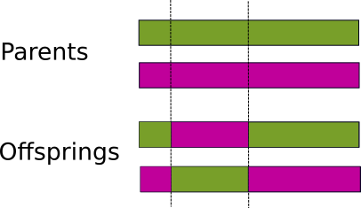

Introduction to genetic algorithms
==================================

Genetic algorithms (GA) are one of the many optimization methods. The idea is based on Darwin’s
evolution principle and random/stochastic processes. Genetic algorithms work with the population of solutions
which are called chromosomes. In every chromosome is an encoded solution for a given problem.
For every chromosome is a calculated fitness value, which quantifies how suitable a solution
(chromosome) is. Using the semi-random process of selection, together with other genetic operators
like crossover and mutation, gives chromosomes a chance to reproduce. This initial population
then creates a new population and this ends one generation cycle.

One of the key components is that chromosomes which encode better solutions (with better fitness
values) have a higher chance of being selected for reproduction. After many generation cycles,
this makes a difference as information from better solutions is more likely to survive or improve
the next generation cycle.

With genetic algorithms, we cannot guarantee finding optimal solution, but we can find a suitable
solution in an acceptable time.

Terminology
___________

| **Chromosome**: represents one solution to the given problem.
| **Gene**: building block of the chromosome. It is one element position in the chromosome.
| **Population**: subset of all the solutions (chromosomes) to the given problem.
| **Generation**: population of the solutions in a certain generation cycle.
| **Fitness function**: objective function which takes chromosome as input and returns the suitability of a given chromosome.
| **Fitness value**: evaluation of a solution (chromosome), or solution suitability.

Structure
_________

Genetic algorithms have following structure:

| **Population initialization:** randomly creates initial population of the solutions.
| **Fitness function:** evaluates every solution and returns the suitability.
| **End condition:** there are different end conditions. (1) It is finished after a certain number of generation cycles. Or (2) it is finished when the best solution meets certain criteria. Or (3) the best solution is not improving after a certain number of generation cycles.
| **Selection:** selects parents for reproduction.
| **Crossover:** creates new chromosomes when combining genes from parent's chromosomes.
| **Mutation:** changes genes in a random fashion.
| **Creates new generation:** the replacement of the old generation with the new one.

    Genetic algorithms structure

.. _encoding:

Encoding
________

Encoding determines the possible values for each gene in a chromosome. Selecting the correct encoding
is one of the challenges in GA and it is one of the most common mistakes.

In GeneticAlgos, the encoding type is configured with the :ref:`gene_interval <gene_intervals>` parameter which has type
``numpy.ndarray``.

Binary encoding
###############

The simplest form of encoding is binary encoding. Each gene can have two values - 0 or 1.

    Binary encoded 9 gene chromosome

GeneticAlgos supports binary encoding and can be configured very easily. We have to specify the
range [0, 2] (0 is inclusive and 2 is exclusive) for each gene and the length of the chromosome.
Below is an example of how we can configure binary encoding for our model. We also have to
configure ``chromosome_type=int``.

.. code-block:: python

    import geneticalgos as ga
    import numpy as np

    # Binary encoding chromosome with 9 genes
    binary_chromosome = np.array([[0, 2]] * 9)

    ga_model = ga.GeneticAlgo(
        fitness_function=sum,
        gene_intervals=binary_chromosome,
        chromosome_type="int"
    )

Numerical encoding
##################

In numerical encoding, genes have numerical values.

GeneticAlgos supports float and integer numerical encoding. The default value is ``float``.

    Integer encoding with gene intervals [0, 5]

    Float encoding with gene intervals [0, 5]

Below is an example for integer numerical encoding and every gene can have values 0, 1, 2, 3, 4.

.. code-block:: python

    import geneticalgos as ga
    import numpy as np

    # Numerical encoding with gene values 0, 1, 2, 3, 4 and chromosome length 9
    numerical_chromosome = np.array([[0, 5]] * 9)

    ga_model = ga.GeneticAlgo(
        fitness_function=sum,
        gene_intervals=numerical_chromosome,
        chromosome_type="int"
    )

Parameter :ref:`gene_interval <gene_intervals>` can have a different range of values for every gene.
Below is a model with a chromosome which has 3 genes with different ranges. Gene 0 binary gene,
gene 1 int values from 5 to 9, gene 3 float values from 2 to 7.

.. code-block:: python

    ga_model = ga.GeneticAlgo(
        fitness_function=sum,
        gene_intervals=np.array([[0, 2], [5, 10], [2, 8]]),
        chromosome_type="int"
    )

.. _fitness_function:

Fitness function
________________

Fitness function is used to evaluate the solution and return the numerical value which represents
the suitability of the given solution. It can be specific for each problem. In many cases, creating
the good fitness function is the biggest challenge, especially in cases where the solution has to
adjust according to many criteria.

In GeneticAlgos, it is mandatory that user creates a fitness function for their model. So far, we
have just used trivial fitness functions as a built-in  ``sum`` function. Below is an example of a fitness
function which is trying to find an optimal set of weights (w1, w2, w3, w4, w5) for maximizing function
``f(x) = 4w1 - 5w2 + 8w3 - 11w4 + 3w5``. Weights are float numbers from 0 to 10. Fitness function
takes chromosome as an argument.

.. code-block:: python

    from geneticalgos import ga
    import numpy as np

    def custom_fitness_function(chromosome):
        # equation 4w1 - 5w2 + 8w3 - 11w4 + 3w5
        function_constants = [4, -5, 8, -11, 3]
        return sum(x * y for x, y in zip(chromosome, function_constants))

    ga_model = ga.GeneticAlgo(
        fitness_function=custom_fitness_function,
        gene_intervals=np.array([[0, 5]] * 5),
    )

.. _selection:

Selection
_________

The goal of selection is to choose chromosomes from the population for reproduction (crossover,
mutation). Selected chromosomes are called parents. Selection has to mimic natural processes,
where stronger individuals have a higher chance of being chosen for reproduction. Then we can
expect that offspring created from quality parents have even better parameters and more suitable
fitness values. On the other hand, selection must preserve diversity and cannot hold too much
of a preference for only a couple of strong individuals.

When selection prefers only a small subset of strong (better fitness value) individuals, then they
can very quickly control a whole population. This will dramatically decrease diversity in a population
and it can lead to that population converging to a local optimum.

When a selection process is very loose and there is not enough pressure to choose stronger individuals,
then the evolution process is very slow. There can be many generation cycles without any improvement.

There are 4 types of selection mechanisms implemented in GeneticAlgos. Each of them has pros and cons.

**1) Fitness proportionate selection**, also known as roulette wheel selection. A chromosome’s chances
of being selected are proportionate to the fitness values of each chromosome and the differences
between them. An advantage is that significantly better solutions have a higher probability of being
chosen, and this can speed up evolution. On the other hand, we are losing diversity quite quickly
in favor of superior individuals and this can lead to early convergence to a local optimum.
This type of selection is helpful in the beginning of the evolution process as it rules out
non-useful chromosomes.

.. code-block:: python

    ga_model.selection_type = "roulette_fitness"

    p(i) - probability of selection for chromosome (i)

**2) Rank selection** uses the rank from the best to the worst chromosome based on fitness value
to determine the probability of a given chromosome being chosen. Two neighboring rank positions
have a relatively small difference in probability regarding their fitness. This method still prefers
better solutions, but not as much as fitness proportionate selection, which is advantageous
in the later phases of the evolution. On the other hand, rank selection converges more slowly
because there is not as much pressure for preferring superior solutions as in **fitness proportionate selection**.

.. code-block:: python

    ga_model.selection_type = "roulette_rank"

    R(i) - chromosome rank, R1 - best, ..., R10 - worst

**3) Tournament** selection randomly selects ``k`` number of chromosomes and chooses the best out of these
to become a parent. The default value for ``k`` in GeneticAlgos is 3. The higher the ``k`` value,
the more they are deemed superior chromosomes. A lower k value means more diversity.

.. code-block:: python

    ga_model.selection_type = "tournament"
    ga_model.selection_k = 3

**4) Random** selection is the default selection type in GeneticAlgos. Every generation cycle
randomly chooses one selection method from: **fitness proportionate selection**, **rank selection**,
and **tournament**. The advantage of this is that it uses different selection methods in a random
fashion, utilizing each of their respective pros. Each phase of the evolution has different
requirements and random selection meets them in the best way for a lot of cases.

.. code-block:: python

    ga_model.selection_type = "random"

.. _crossover:

Crossover
_________

Crossover is a fundamental genetic operator between two selected parents. Parents exchange genes
to create new individuals (offspring). Therefore, offspring chromosomes have genes from both parents.

There are 4 types of crossover implemented in GeneticAlgos.

**1) One-point** randomly picks one crossover point in chromosomes. Genes to the right of that point
are swapped between the two parent chromosomes. This results in two offspring, each carrying some
genetic information from both parents.

    One-point crossover

One-point crossover can be configured with the following command:

.. code-block:: python

    ga_model.crossover_type = "one_point"

**2) Two-points** randomly picks two crossover points. The genes in-between the two points are
swapped between the parent organisms.

    Two-points crossover

Two-points crossover can be configured with the following command:

.. code-block:: python

    ga_model.crossover_type = "two_points"

**3) Uniform** crossover treats each gene separately. Both parents have a 50% chance of their gene
ending up in their offspring. Some researchers consider uniform crossover the most powerful
method because it allows the offspring chromosomes to search all possibilities of recombining those
different genes in parents.

.. figure:: _static/crossover_uniform.png
    :align: center

    Uniform crossover

Uniform crossover can be configured with the following command:

.. code-block:: python

    ga_model.crossover_type = "uniform"

**4) Random** crossover randomly chooses a crossover type in each generation cycle. It is the default
crossover method.

.. code-block:: python

    ga_model.crossover_type = "random"

**Crossover probability** specifies how likely is that crossover is applied to selected parents.
GeneticAlgos has a default ``crossover_prob`` of 90%. It means there is 90% chance that crossover
is applied to the given parent pair.

We can easily change crossover probability to a different value:

.. code-block:: python

    ga_model.crossover_prob = 0.8

.. _mutation:

Mutation
________

Mutation is a genetic operator which alters one or more gene values in a chromosome from its initial value.
Advantage is that it maintains genetic diversity from one generation to the next.

GeneticAlgos uses random mutation. When a gene is selected for mutation, it changes value to any random
value from the :ref:`gene_interval <gene_intervals>` range.

    Mutation

In GeneticAlgos, mutation is applied to each gene with **mutation probability**. The default value
is 20%, meaning there is 20% chance that gene is going to mutate. Increasing mutation probability
brings more diversity, but when it is too high it can be disruptive and lead to losing original
gene information.

We can change mutation probability:

.. code-block:: python

    ga_model.mutation_prob = 0.3

.. _creating_new_population:

Creating new population
_______________________

In traditional implementation of the genetic algorithms when genetic operators create offspring,
they replace the parents of the new population. In GeneticAlgos, this type of new population is called
``always_offsprings``. One disadvantage is that sometimes we might lose quality individuals when
genetic reproduction creates less suitable offspring. However, an advantage is that there is
increased diversity from one generation to next.

.. code-block:: python

    ga_model.new_pop_type = "always_offsprings"

It might happen that even two quality fitness parents produce less suitable offspring (with a worse
fitness value than their parents). For this reason, there is the ``tournament`` new population type
which is implemented in GeneticAlgos. It selects the two best chromosomes amongst parents and offspring.
The main disadvantage of the tournament type is that when a single superior chromosome is selected
to be a parent to more reproduction pairs, it can lead to a situation where this individual controls
the population.

.. code-block:: python

    ga_model.new_pop_type = "tournament"

The default value for a new population type in GeneticAlgos is random which randomly selects a new
population type between ``always_offsprings`` or ``tournament``.

Another variant of constructing new population is **Elitism**. Elitism allows the best individuals
to be carried over to the next generation without any gene change. This method guarantees that
the solution quality obtained by the genetic algorithms will not decrease from one generation
to the next.

GeneticAlgos has implemented elitism and by default, the best 2 solutions are carried over to next
generation.

The number of elite solutions can be configured with ``n_elite`` parameter. If ``n_elite`` is equal
to 0, there is no elitism applied to evolution.

.. code-block:: python

    ga_model.n_elite = 5

.. hint:: When the number of ``n_elite + (2 * n_pairs)`` is greater than ``population_size`` then **ValueError** is raised with guidance to which interval is allowed for ``n_elite``.